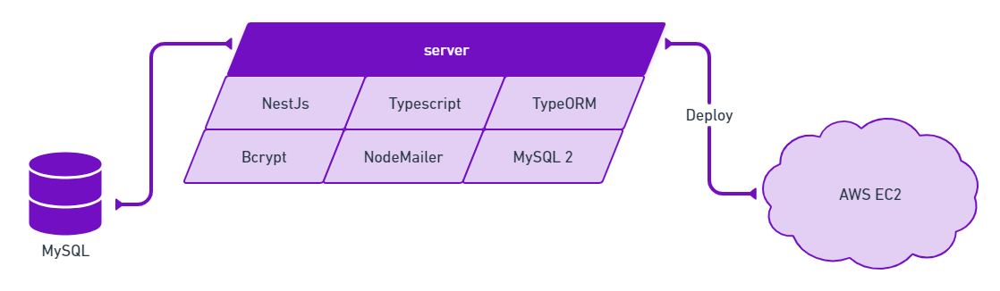

<p align="center">
  <a href="https://findyourbestfriend.social/" target="blank"></a>
</p>
  
<p align="center"><a href="https://findyourbestfriend.social" target="_blank">Find Your Best Friend</a></p>
<p align="center">
  
  
  
</p>

Esse é o projeto server do Find Your Best Friend. O projeto foi feito utilizando o framework NestJS.

## Arquitetura

O server segue a arquitetura mostrada no diagrama à seguir:



## Deploy

O server tem deploy automático na AWS EC2. Toda vez que há uma alteração no código da branch main é automaticamente enviado ao servidor da AWS EC2.

# Primeiros Passos

## Banco de Dados

Para o banco de dados foi utilizado o MySQL, que por sua vez foi instalado através do [MySQL Workbench](https://www.mysql.com/products/workbench/).

Os dados são consumidos utilizando o [TypeORM](https://typeorm.io/) junto da biblioteca para conexão [MySQL 2](https://github.com/sidorares/node-mysql2#readme)

## NodeJs

Para instalar as dependências é necessário ter o [NodeJs](https://nodejs.org/) instalado na versão 16.15.1

## Instalar as dependências do projeto

Para instalar o as dependêncais do projeto basta executar o comando abaixo

```bash
$ npm install
```

## Rodando o projeto

Para rodar o projeto localmente é recomendado utilizar o **watch mode**, onde qualquer alteração do projeto será refletida na execução

```bash
# development
$ npm run start

# watch mode
$ npm run start:dev

# production mode
$ npm run start:prod
```

## Rodando os Testes

A aplicação possui testes automatizados, onde é possível verificar se a aplicação está funcionando como previsto

```bash
# unit tests
$ npm run test

# e2e tests
$ npm run test:e2e

# test coverage
$ npm run test:cov
```

## Documentação

A documentação das rotas foi feita em Swagger. [Veja aqui](https://api.findyourbestfriend.social/docs).


## Licença

FYBF é licenciado pela licença do [MIT](https://github.com/FindYourBestFriend/server/blob/main/LICENSE.md).
